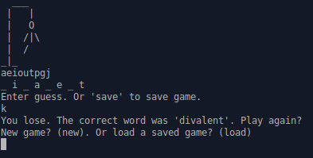

# hangman
An assignment from [The Odin Project](https://www.theodinproject.com/) to implement a game of hangman.

Additional information can be found at https://www.theodinproject.com/lessons/ruby-hangman

## How to Play

| <code>ruby lib/hangman_game.rb</code>

A new game can be started or one can be loaded from file.
|<code>save</code> can be used at any time to save the game to file.

After correctly guessing the work or too many incorrect guesses the game will end.

| <code>exit</code> can be used at any time to exit

## Features

- a word is randomly chosen
- win condition when correctly guessing the word
- loss condition after too many incorrect guesses
- only valid input is allowed
- a save and load system

## Technologies
- Written in Ruby.
- Git for version control